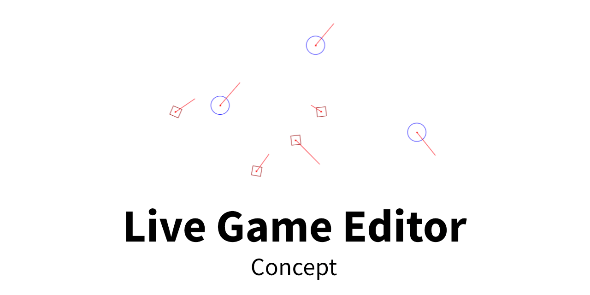

# Live game editor – Concept

- [About](#about)
- [Features](#features)
- [Examples](#examples)

 

---

## About

A proof of concept about how a 'live' game editor and debugger can work with HTML canvas. The game objects have a simple hit test interaction: Enemies will change their border colour if hit.

This is just a tech demo. There is no browser/device optimization or error checking and the code 'style' is pretty much happy hardcoding ;)

  

## Features

- Add interactive elements to the scene
- Play/pause the animation
- Change the view style

  

## Examples

Find the live version here:

- [Live demo »](https://christianoellers.github.io/Live-Game-Editor-Concept)
